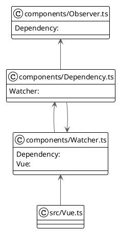

# 一个 MVVM 框架

## 项目要求

实现一个简单的 MVVM 框架

- [x] 实现数据劫持
- [x] 实现发布订阅模式
- [x] 实现数据单向绑定
- [x] 实现双向绑定
- [x] 使用 Typescript
- [x] 单测覆盖率 80%

## 使用方法

- 在　`main.ts` 中定义 `MVVM` 入口, 并运行 `npm run start`

- 需要传入 `el` 为绑定的`dom`元素, `data` 为传递的数据

示例:

`main.ts`:

```ts
import Vue from "./Vue";
new Vue({
    el: '#app',
    data: {
        name: 'Lubricants',
        more: {
            salary: 10000
        }
    }
});
```

`index.html`:

```html
...
<body>
<div id="app">
    <p>{{name}}</p>
    <input type="text" v-model="name"/>
    <p>{{more.salary}}</p>
    <input type="text" v-model="more.salary"/>
</div>
</body>
...
```

该项目集成了 Webpack Server, 运行 `npm run start` 即可开启服务器, 默认地址为 `localhost:8888`

## 实现细节

### 数据劫持

使用 `Object.defineProperty` 实现对数据进行 `get` 和 `set` 的劫持

```ts
Object.defineProperty(data_instance, key, {
    enumerable: true,
    configurable: true,
    get() {
        // ...
        return value;
    },
    set(newVal) {
        // ...
        dependency.notify();
    },
});
```

### 发布-订阅模式



详见 `Dependency` 和 `Watcher` 实现

### 单向和双向数据绑定

`Compiler` 对 DOM 进行了解析, 并在创建 `Watcher` 时设置了回调函数 callback 从而告诉 `Watcher` 该如何将新数据更新到 DOM 结点上

在 `Compiler` 中还为输入框结点设置了对 input 事件的监听, 当监听到输入事件时立即更新 `vm.$data` 的值, 从而实现双向绑定

### 单元测试

该项目集成了 `Jest` 测试框架, 编写了一个简单的测试文件, 详见 `./test/Vue.test.js`

测试结果如下:


